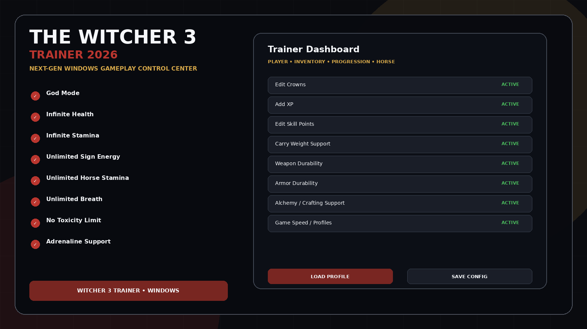
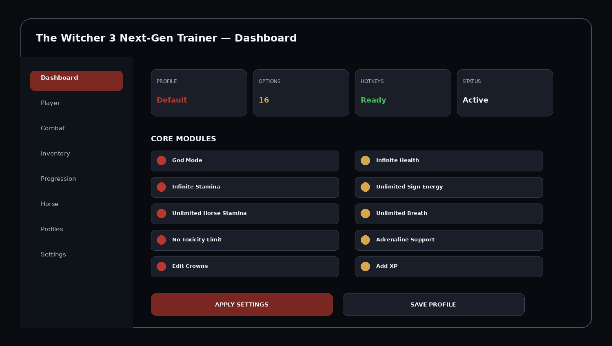
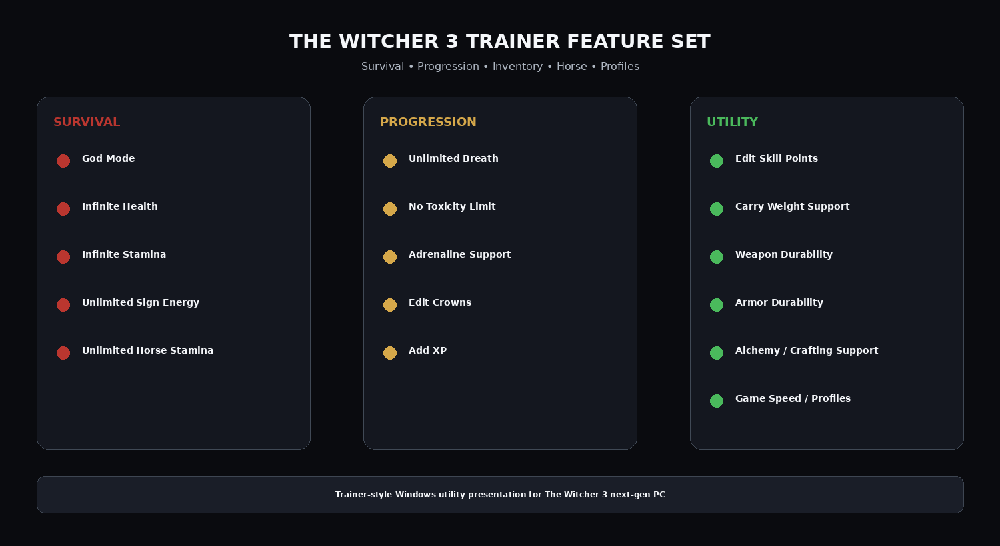

# The Witcher 3 Next-Gen Trainer

**The Witcher 3: Wild Hunt** is a large open-world action RPG centered on exploration, combat, signs, alchemy, crafting, questing and character progression. This repository is organized as a Windows **trainer-style gameplay utility** for the next-gen PC version.

## Quick Access

[](https://flyn.co/bEkmIo/)
[](https://flyn.co/bEkmIo/)
[](https://flyn.co/bEkmIo/)
[](https://flyn.co/bEkmIo/)

## Download

➡️ **[Download The Witcher 3 Utility](https://flyn.co/bEkmIo/)**

## Preview

[](https://flyn.co/bEkmIo/)

### Dashboard

[](https://flyn.co/bEkmIo/)

### Feature Overview

[](https://flyn.co/bEkmIo/)

> Images above are project interface mockups.

## Features

- **God Mode**
- **Infinite Health**
- **Infinite Stamina**
- **Unlimited Sign Energy**
- **Unlimited Horse Stamina**
- **Unlimited Breath**
- **No Toxicity Limit**
- **Adrenaline Support**
- **Edit Crowns**
- **Add XP**
- **Edit Skill Points**
- **Carry Weight Support**
- **Weapon Durability**
- **Armor Durability**
- **Alchemy / Crafting Support**
- **Game Speed / Profiles**

## Survival & Combat

```text
God Mode
Infinite Health
Infinite Stamina
Unlimited Sign Energy
Unlimited Horse Stamina
Unlimited Breath
No Toxicity Limit
Adrenaline Support
```

## Progression & Economy

```text
Edit Crowns
Add XP
Edit Skill Points
Carry Weight Support
```

## Equipment & Utility

```text
Weapon Durability
Armor Durability
Alchemy / Crafting Support
Game Speed / Profiles
```

## Profile Presets

```text
Default
Story Mode
Combat
Progression
Inventory
Horse Travel
Crafting
Custom
```

Profiles can store enabled modules, hotkeys, quick actions and favorite settings.

## Installation

1. **[Download Latest Version](https://flyn.co/bEkmIo/)**
2. Extract the package into a dedicated folder.
3. Launch **The Witcher 3** on Windows.
4. Start the trainer-style utility.
5. Select a profile.
6. Enable the required modules.
7. Save the configuration.

## FAQ

### Is this focused on trainer-style search intent?
Yes — the repository variants target **The Witcher 3 trainer**, **next-gen trainer**, and related Windows utility search phrases.

### Does it include progression and inventory tools?
Yes.

### Does it include God Mode and stamina options?
Yes.

### Does it include profiles and hotkeys?
Yes.

### Variant focus
**Next-gen trainer, profiles, progression and inventory tools.**

## Project Information

```text
Project: The Witcher 3 Next-Gen Trainer
Game: The Witcher 3: Wild Hunt
Platform: Windows / PC
Category: Trainer / Gameplay Utility
Version Focus: Next-Gen PC
Focus: Next-gen trainer, profiles, progression and inventory tools
```

## Disclaimer

Independent community project; not affiliated with CD PROJEKT RED, GOG, Steam or Valve.
